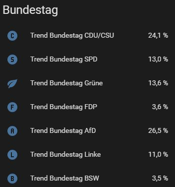
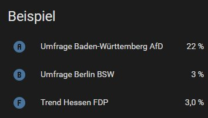

# DAWUM Wahlumfragen für Home Assistant

Aktuelle Wahlumfragen aus der freien [DAWUM](https://dawum.de)-Datenbank
in Home Assistant – für den Bundestag und alle 16 Landtage, mit jeweils
einem Sensor pro Partei und einem 14-Tage-Trend als Mittelwert über
alle Institute.

Reines YAML-Package, ohne Custom Component, ohne HACS. Eine Datei
ablegen, neu starten, fertig.


## Vorschau



*Trend-Werte für den Bundestag als einfache Entity-Karte – jeder
Eintrag ist ein eigener Sensor mit eigenem Verlauf in den Long-Term
Statistics.*



*Sensoren aus verschiedenen Parlamenten lassen sich beliebig
kombinieren – hier eine kleine Mischung aus Baden-Württemberg,
Berlin und Hessen.*


## Was du bekommst

238 Sensor-Entitäten aus einem einzigen REST-Aufruf pro Stunde:

| Schema | Bedeutung |
|:--|:--|
| `sensor.umfrage_<land>_<partei>` | Wert der jüngsten Einzelumfrage |
| `sensor.trend_<land>_<partei>` | 14-Tage-Mittelwert über alle Institute |

Beispiele:

- `sensor.umfrage_bundestag_afd` – aktuelle AfD-Umfrage zum Bundestag
- `sensor.trend_bayern_cdu_csu` – CSU-Trend in Bayern (14 Tage)
- `sensor.umfrage_thuringen_grune` – aktuelle Grünen-Umfrage in Thüringen
- `sensor.trend_nordrhein_westfalen_spd` – SPD-Trend in NRW

Alle Sensoren haben `unit_of_measurement: %` und
`state_class: measurement` und werden damit automatisch in den
Long-Term Statistics von Home Assistant aufgezeichnet. Verlaufsgraphen
und Statistik-Karten funktionieren ohne Zusatzkonfiguration.


## Voraussetzungen

- Home Assistant 2022.4 oder neuer (für trigger-basierte Template-Sensoren).
- Aktivierte Packages-Konfiguration in `configuration.yaml` (siehe Installation).
- Internetzugang vom Home-Assistant-Host zur DAWUM-API.


## Installation

1. Datei `packages/dawum_umfragen.yaml` in dein Home-Assistant-
   Konfigurationsverzeichnis kopieren, sodass sie unter
   `<config>/packages/dawum_umfragen.yaml` liegt.
   Den Ordner `packages` ggf. neu anlegen.

2. In `configuration.yaml` sicherstellen, dass Packages aktiviert sind:

   ```yaml
   homeassistant:
     packages: !include_dir_named packages
   ```

3. *Entwicklerwerkzeuge → YAML → Konfiguration prüfen* aufrufen –
   sollte „Konfiguration gültig!" melden.

4. Home Assistant **vollständig neu starten**. Beim Hinzufügen eines
   neuen Packages reicht „YAML neu laden" nicht aus.

5. Unter *Entwicklerwerkzeuge → Zustände* nach `umfrage_` oder
   `trend_` filtern, um die neuen Sensoren zu finden.


## Lovelace-Karten

Im Ordner `lovelace/examples.yaml` liegen mehrere fertige Karten zum
Kopieren – jeweils zwischen den Kommentar-Trennlinien:

- Einfache Liste aller Parteien zum Bundestag (ohne HACS)
- Balkendiagramm mit `bar-card` (HACS)
- Donut-Diagramm mit `apexcharts-card` (HACS)
- Gauge mit Verlaufsgraph für eine einzelne Partei
- Vergleich derselben Partei über mehrere Bundesländer
- Glance-Karte für eine Bundeslandübersicht
- `vertical-stack` mit allem zusammen auf einer Seite

Pro manueller Karte immer **einen** Block einfügen
(*Karte hinzufügen → Manuell* im UI-Editor).


## Anwendungsbeispiele

Die Sensoren sind ganz normale numerische Sensoren – damit lassen sich
beliebige Home-Assistant-Automationen darauf aufbauen. Ein paar Ideen
zur Inspiration:

### Schwellenwert-Benachrichtigung

Push aufs Handy, sobald eine Partei bundesweit über einen bestimmten
Wert klettert:

```yaml
automation:
  - alias: "Umfragewert über 30 Prozent"
    trigger:
      - platform: numeric_state
        entity_id: sensor.umfrage_bundestag_afd
        above: 30
    action:
      - service: notify.mobile_app_dein_geraet
        data:
          title: "Neue Umfrage"
          message: >
            AfD im Bund jetzt bei
            {{ states('sensor.umfrage_bundestag_afd') }} %.
```

### Morgenbriefing per Sprachausgabe

Bei der Morgenroutine die aktuellen Werte auf einem Smart Speaker
vorlesen lassen:

```yaml
- service: tts.cloud_say   # oder eine andere TTS-Engine
  data:
    entity_id: media_player.kuechen_lautsprecher
    message: >
      Sonntagsfrage Bundestag im 14-Tage-Trend: Union bei
      {{ states('sensor.trend_bundestag_cdu_csu') }} Prozent,
      AfD bei {{ states('sensor.trend_bundestag_afd') }} Prozent,
      SPD bei {{ states('sensor.trend_bundestag_spd') }} Prozent.
```

### Sprung-Alarm bei großen Veränderungen

Sofort-Benachrichtigung, wenn sich ein Wert gegenüber der vorherigen
Umfrage um mehr als zwei Prozentpunkte verschiebt:

```yaml
trigger:
  - platform: state
    entity_id: sensor.umfrage_bundestag_spd
condition:
  - condition: template
    value_template: >
      {{ (states('sensor.umfrage_bundestag_spd') | float(0)
          - trigger.from_state.state | float(0)) | abs > 2 }}
```

### Ambient-Anzeige in Parteifarben

Eine smarte Lampe (Hue, Lifx, ESPHome-LED-Strip) leuchtet in der
Markenfarbe der jeweils führenden Partei – z.B. schwarz für die Union,
rot für SPD, grün für Grüne, blau für AfD. Hübsches Statusobjekt für
den Flur oder den Schreibtisch.

### Smartphone-Widget per Companion App

Die [Home Assistant Companion App](https://companion.home-assistant.io)
bringt Homescreen-Widgets mit, die einen einzelnen Sensorwert direkt
anzeigen – ideal für den eigenen Lieblings-Trend, ohne erst die App
öffnen zu müssen. Auf Wear OS und der Apple Watch funktioniert das
analog als Tile beziehungsweise Komplikation.

### E-Ink-Statusdisplay

Ein ESPHome-betriebenes E-Ink-Modul (MagTag, M5Paper, Inkplate) lässt
sich als dauerhaftes Wahltrend-Display an die Wand hängen. Werte
werden über die Home-Assistant-API abgefragt, ein Update einmal pro
Tag genügt – die E-Ink-Anzeige bleibt auch ohne Strom erhalten.

### Telegram- oder Discord-Bot

Per Slash-Kommando oder zeitgesteuert schickt Home Assistant einen
formatierten Schnappschuss aller Bundestagswerte in eine
Telegram-Gruppe oder einen Discord-Channel. Macht sich gut als
wöchentliches Update für Polit-interessierte Freunde.

### Wahltag-Modus

Am Tag einer Bundestags- oder Landtagswahl schaltet der Fernseher
automatisch auf den Tagesschau-Stream, das Smart-Home-Briefing
erinnert an den Wahllokal-Schluss, und das Lovelace-Dashboard
wechselt für 24 Stunden in eine spezielle Wahlabend-Ansicht mit
Live-Umfragen und Hochrechnungen.


## Sensor-Schema im Detail

### Parlament-Slugs

Home Assistant entfernt Umlaute beim Erzeugen der Entity-IDs **komplett**
statt zu transliterieren („Grüne" → `grune`, nicht `gruene`). Die
finalen Slugs sind:

| Parlament | Slug |
|:--|:--|
| Bundestag | `bundestag` |
| Baden-Württemberg | `baden_wurttemberg` |
| Bayern | `bayern` |
| Berlin | `berlin` |
| Brandenburg | `brandenburg` |
| Bremen | `bremen` |
| Hamburg | `hamburg` |
| Hessen | `hessen` |
| Mecklenburg-Vorpommern | `mecklenburg_vorpommern` |
| Niedersachsen | `niedersachsen` |
| Nordrhein-Westfalen | `nordrhein_westfalen` |
| Rheinland-Pfalz | `rheinland_pfalz` |
| Saarland | `saarland` |
| Sachsen | `sachsen` |
| Sachsen-Anhalt | `sachsen_anhalt` |
| Schleswig-Holstein | `schleswig_holstein` |
| Thüringen | `thuringen` |

### Partei-Slugs

| Partei | Slug |
|:--|:--|
| CDU/CSU | `cdu_csu` |
| SPD | `spd` |
| Grüne | `grune` |
| FDP | `fdp` |
| AfD | `afd` |
| Linke | `linke` |
| BSW | `bsw` |

In Bayern wird der `cdu_csu`-Sensor automatisch auf den CSU-Wert
gemappt; im Bundestag auf CDU/CSU; in den übrigen Bundesländern auf CDU.

### Verhalten bei fehlenden Daten

Sensoren von Parteien, die in der jeweiligen Umfrage nicht abgefragt
wurden (z.B. BSW in einigen Stadtstaaten), bleiben `unknown`.
Das ist gewollt und zeigt direkt an, wo Daten dünn sind.

Trend-Sensoren ohne Umfragen in den letzten 14 Tagen sind ebenfalls
`unknown` – betrifft vor allem kleinere Bundesländer wie Bremen oder
das Saarland, die selten umfragt werden.


## Architektur

Ein einzelner REST-Aufruf pro Stunde lädt
`https://api.dawum.de/newest_surveys.json` – die kompakte API-Variante
mit jeweils der neuesten Umfrage pro Institut und Parlament.

Jeder Sensor rendert seinen Wert direkt aus dem JSON-Response über
ein `value_template`. Die JSON-Daten werden nicht als Sensor-Attribute
persistiert; damit umgeht die Lösung das ~16-KB-Limit für
Sensor-Attribute in Home Assistant, das bei naiven Implementierungen
mit `json_attributes` zuschlägt.

Trend-Werte sind ein einfacher arithmetischer Mittelwert über alle
Umfragen aller Institute der letzten 14 Tage. Der DAWUM-Wahltrend auf
der Website verwendet eine zusätzliche Gewichtung nach Aktualität
(jüngere Umfragen stärker); die Werte unterscheiden sich daher
typischerweise um wenige Zehntelprozentpunkte.


## Anpassen

### Trend-Zeitraum ändern

In den Trend-Templates `days=14` durch einen anderen Wert ersetzen:

```yaml
{% set cutoff = (now() - timedelta(days=21)).strftime("%Y-%m-%d") %}
```

### Aktualisierungsintervall

`scan_interval: 3600` im `rest:`-Block anpassen (Wert in Sekunden).
Eine stündliche Abfrage ist ausreichend – DAWUM aktualisiert
typischerweise nur wenige Male pro Woche.

### Weitere Parteien aufnehmen

Im YAML einen neuen Sensor-Block ergänzen und im `value_template`
beim Shortcut-Match die gewünschte Partei eintragen. Mögliche Werte
sind unter anderem `Freie Wähler`, `SSW`, `BVB/FW`, `Tierschutzpartei`
und `Sonstige`.


## Datenherkunft und Lizenz

### Daten

Die Wahlumfragen stammen aus der freien Datenbank von
[DAWUM](https://dawum.de) und werden unter der
**[Open Database License (ODbL)](https://opendatacommons.org/licenses/odbl/)**
bereitgestellt.

Bei Verwendung der Daten – etwa in Screenshots, Berichten oder eigenen
Anwendungen, die auf diese Sensoren aufbauen – sind die
Lizenzbedingungen zu beachten. Insbesondere ist DAWUM als Quelle zu
nennen und zu verlinken; bei abgeleiteten Datenbanken oder
Datensammlungen muss die ODbL ebenfalls angewendet werden. Details
und Hinweise zur Benennung unter
[dawum.de/Urheberrecht](https://dawum.de/Urheberrecht/).

### Konfigurationscode

Die YAML-Dateien dieses Repositorys stehen unter der MIT-Lizenz
(siehe [LICENSE](LICENSE)). Sie verarbeiten DAWUM-Daten zur Laufzeit,
stellen aber selbst keine abgeleitete Datenbank dar.


## Beitragen

Issues und Pull Requests sind willkommen – besonders hilfreich:

- Fehlerberichte mit konkreten Sensor-Werten und Logauszügen
- weitere Lovelace-Beispiele
- Anpassungen für regionale Besonderheiten (SSW, Freie Wähler etc.)


## Danksagung

Diese Lösung wäre ohne die freie DAWUM-Datenbank von Philipp Guttmann
nicht möglich. Vielen Dank für das Bereitstellen der API und für die
freundliche Erlaubnis zur Nutzung im Rahmen dieses Projekts.
